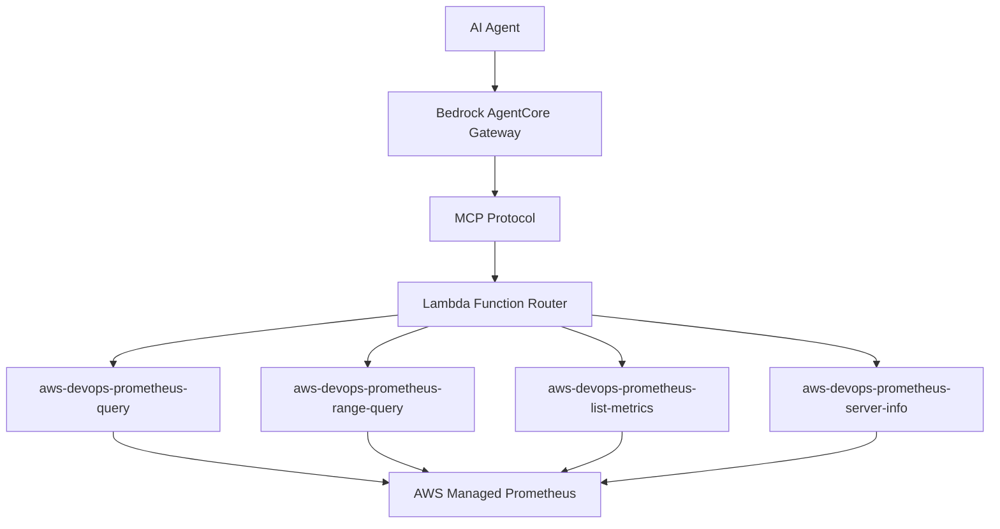

# AWS Managed Prometheus Lambda Functions

A collection of specialized AWS Lambda functions for querying AWS Managed Prometheus (AMP), following Lambda best practices with single responsibility principle, independent scaling, and optimized deployment packages.

## Architecture Overview

This implementation breaks down Prometheus operations into separate Lambda functions:

- **`lambda_query.py`**: Instant PromQL queries
- **`lambda_range_query.py`**: Range queries over time periods  
- **`lambda_list_metrics.py`**: Metric discovery and listing
- **`lambda_server_info.py`**: Server configuration and build information
- **`lambda_find_workspace.py`**: Find workspace endpoint URLs by alias or ID
- **`prometheus_utils.py`**: Shared utilities for all functions

## Benefits of This Architecture

✅ **Single Responsibility**: Each function handles one specific operation  
✅ **Smaller Packages**: Faster cold starts and reduced deployment time  
✅ **Independent Scaling**: Functions scale based on individual usage patterns  
✅ **Better Debugging**: Easier to isolate and troubleshoot specific operations  
✅ **Granular Permissions**: Each function has minimal required IAM permissions  
✅ **Code Reuse**: Shared utilities eliminate duplication while maintaining separation  

## Features

- **AWS SigV4 Authentication**: Secure authentication for AWS Managed Prometheus
- **Automatic Retries**: Exponential backoff with jitter for resilient operations
- **Comprehensive Error Handling**: Detailed error messages and logging
- **Standardized Responses**: Consistent response format across all functions
- **Parameter Validation**: Robust input validation with clear error messages

## Quick Start

### 1. Deploy All Lambda Functions

```bash
cd lambda/prometheus
./deploy_all.sh
```

This will deploy all five specialized functions:
- `aws-devops-prometheus-query`
- `aws-devops-prometheus-range-query` 
- `aws-devops-prometheus-list-metrics`
- `aws-devops-prometheus-server-info`
- `aws-devops-prometheus-find-workspace`

### 2. Deploy Individual Functions (Optional)

```bash
# Deploy only specific functions
./deploy_query.sh           # Instant queries
./deploy_range_query.sh     # Range queries
./deploy_list_metrics.sh    # Metric discovery
./deploy_server_info.sh     # Server information
./deploy_find_workspace.sh  # Workspace discovery
```

### 3. Test Locally

```bash
# Test all functions
python3 test_individual_functions.py

# Test original monolithic function (for comparison)
python3 test_lambda_local.py
```

### 4. Integration with Bedrock AgentCore Gateway

These Lambda functions are designed to be integrated with **Bedrock AgentCore Gateway** through the **MCP (Model Context Protocol)** framework, providing seamless access to Prometheus monitoring capabilities within your AI agents.

**Integration Benefits:**
- ✅ **Secure Authentication**: JWT-based authentication through AgentCore Gateway
- ✅ **Standardized Interface**: MCP protocol for consistent tool integration
- ✅ **Automatic Discovery**: Functions automatically available to agents
- ✅ **Scalable Architecture**: Gateway handles load balancing and routing
- ✅ **Centralized Management**: Single point for monitoring and configuration

**Usage in Agents:**
```python
# Functions will be available as MCP tools in your agent
# No direct integration code needed - handled by AgentCore Gateway
```

## Lambda Functions

### 1. Query Function (`aws-devops-prometheus-query`)

Execute instant PromQL queries at a specific point in time.

**Function**: `lambda_query.py`  
**Memory**: 256 MB  
**Timeout**: 30 seconds  

**Parameters:**
- `workspace_url`: Your AMP workspace URL
- `query`: PromQL query string
- `time` (optional): Timestamp for evaluation

**Example:**
```json
{
  "workspace_url": "https://aps-workspaces.us-east-1.amazonaws.com/workspaces/ws-12345",
  "query": "up",
  "time": "2023-01-01T12:00:00Z"
}
```

### 2. Range Query Function (`aws-devops-prometheus-range-query`)

Execute PromQL queries over time ranges.

**Function**: `lambda_range_query.py`  
**Memory**: 512 MB  
**Timeout**: 60 seconds  

**Parameters:**
- `workspace_url`: Your AMP workspace URL
- `query`: PromQL query string
- `start`: Start timestamp (RFC3339 or Unix)
- `end`: End timestamp (RFC3339 or Unix)
- `step`: Query resolution (e.g., "15s", "1m", "1h")

**Example:**
```json
{
  "workspace_url": "https://aps-workspaces.us-east-1.amazonaws.com/workspaces/ws-12345",
  "query": "rate(cpu_usage_total[5m])",
  "start": "2023-01-01T00:00:00Z",
  "end": "2023-01-01T01:00:00Z",
  "step": "15s"
}
```

### 3. List Metrics Function (`aws-devops-prometheus-list-metrics`)

Discover and list all available metric names.

**Function**: `lambda_list_metrics.py`  
**Memory**: 256 MB  
**Timeout**: 30 seconds  

**Parameters:**
- `workspace_url`: Your AMP workspace URL

**Example:**
```json
{
  "workspace_url": "https://aps-workspaces.us-east-1.amazonaws.com/workspaces/ws-12345"
}
```

### 4. Server Info Function (`aws-devops-prometheus-server-info`)

Get server configuration and build information.

**Function**: `lambda_server_info.py`  
**Memory**: 256 MB  
**Timeout**: 30 seconds  

**Parameters:**
- `workspace_url`: Your AMP workspace URL

**Example:**
```json
{
  "workspace_url": "https://aps-workspaces.us-east-1.amazonaws.com/workspaces/ws-12345"
}
```

### 5. Find Workspace Function (`aws-devops-prometheus-find-workspace`)

Find Prometheus workspace endpoint URLs by alias or workspace ID.

**Function**: `lambda_find_workspace.py`  
**Memory**: 256 MB  
**Timeout**: 30 seconds  

**Parameters:**
- `alias` (optional): Workspace alias/name to search for
- `workspace_id` (optional): Specific workspace ID to find
- `list_all` (optional): Set to `true` to list all workspaces
- `region` (optional): AWS region (defaults to current region)

**Examples:**
```json
// Find by alias
{
  "alias": "production-metrics",
  "region": "us-east-1"
}

// Find by workspace ID
{
  "workspace_id": "ws-12345678-abcd-1234-efgh-123456789012",
  "region": "us-east-1"
}

// List all workspaces
{
  "list_all": true,
  "region": "us-east-1"
}
```

**Response:**
```json
{
  "statusCode": 200,
  "workspace": {
    "workspaceId": "ws-12345678-abcd-1234-efgh-123456789012",
    "alias": "production-metrics",
    "arn": "arn:aws:aps:us-east-1:123456789012:workspace/ws-12345678-abcd-1234-efgh-123456789012",
    "status": "ACTIVE",
    "prometheusEndpoint": "https://aps-workspaces.us-east-1.amazonaws.com/workspaces/ws-12345678-abcd-1234-efgh-123456789012",
    "createdAt": "2023-01-01T00:00:00Z",
    "tags": {}
  },
  "message": "Found workspace by alias: production-metrics"
}
```

## Response Format

All operations return a standardized response:

```json
{
  "statusCode": 200,
  "headers": {
    "Content-Type": "application/json",
    "Access-Control-Allow-Origin": "*"
  },
  "body": {
    "success": true,
    "operation": "query",
    "timestamp": "2023-01-01T12:00:00Z",
    "data": {
      "resultType": "vector",
      "result": [...]
    }
  }
}
```

## Error Handling

The function includes comprehensive error handling:

- **Authentication Errors**: Invalid AWS credentials or permissions
- **Network Errors**: Connection timeouts, rate limiting
- **Query Errors**: Invalid PromQL syntax or missing metrics
- **Parameter Errors**: Missing or invalid request parameters

Error responses include detailed messages:

```json
{
  "statusCode": 500,
  "body": {
    "success": false,
    "error": "Missing required parameter: query",
    "timestamp": "2023-01-01T12:00:00Z"
  }
}
```

## AWS Permissions

The Lambda function requires these IAM permissions:

```json
{
  "Version": "2012-10-17",
  "Statement": [
    {
      "Effect": "Allow",
      "Action": [
        "aps:QueryMetrics",
        "aps:GetLabels",
        "aps:GetSeries",
        "aps:GetMetricMetadata"
      ],
      "Resource": "*"
    }
  ]
}
```

## Integration Architecture

### Bedrock AgentCore Gateway Integration

These Lambda functions are designed to integrate seamlessly with **Bedrock AgentCore Gateway**, providing Prometheus monitoring capabilities to AI agents through the MCP protocol.



### Direct Lambda Invocation (for testing)

```bash
# Test individual functions
aws lambda invoke \
  --function-name aws-devops-prometheus-query \
  --payload '{"workspace_url":"YOUR_URL","query":"up"}' \
  response.json
```

### Function Endpoints

Each function provides a specific capability:

- **Query**: `aws-devops-prometheus-query` - Instant PromQL queries
- **Range Query**: `aws-devops-prometheus-range-query` - Time-series data
- **List Metrics**: `aws-devops-prometheus-list-metrics` - Metric discovery
- **Server Info**: `aws-devops-prometheus-server-info` - Configuration details

## Common PromQL Queries

### System Monitoring

```promql
# Check service availability
up

# CPU usage rate
rate(cpu_usage_total[5m])

# Memory usage
memory_usage_bytes

# Disk usage
disk_usage_bytes

# Network traffic
rate(network_bytes_total[5m])
```

### Application Monitoring

```promql
# HTTP request rate
rate(http_requests_total[5m])

# HTTP error rate
rate(http_requests_total{status=~"5.."}[5m])

# Response time percentiles
histogram_quantile(0.95, rate(http_request_duration_seconds_bucket[5m]))

# Database connections
database_connections_active
```

### Infrastructure Monitoring

```promql
# Node CPU usage
100 - (avg by (instance) (rate(node_cpu_seconds_total{mode="idle"}[5m])) * 100)

# Node memory usage
(1 - (node_memory_MemAvailable_bytes / node_memory_MemTotal_bytes)) * 100

# Disk space usage
100 - ((node_filesystem_avail_bytes * 100) / node_filesystem_size_bytes)
```

## Troubleshooting

### Common Issues

1. **Authentication Errors**
   - Ensure AWS credentials are properly configured
   - Verify IAM permissions for AMP access
   - Check workspace URL format

2. **Query Errors**
   - Validate PromQL syntax
   - Ensure metrics exist in your workspace
   - Check time ranges for range queries

3. **Network Errors**
   - Verify workspace URL accessibility
   - Check VPC/security group settings if applicable
   - Monitor for rate limiting

### Debug Mode

Enable debug logging by setting environment variables:

```bash
export AWS_LAMBDA_LOG_LEVEL=DEBUG
```

### Testing with Real Data

1. Replace the example workspace URL in test files
2. Ensure your AMP workspace has data
3. Use actual metric names from your environment

## Architecture Comparison

### Before (Monolithic)
```
lambda_prometheus.py (1 function)
├── All operations in single handler
├── Large deployment package (~10MB)
├── Single scaling profile
├── Complex error debugging
└── Broad IAM permissions
```

### After (Microservices)
```
lambda/prometheus/
├── lambda_query.py              # Instant queries
├── lambda_range_query.py        # Range queries  
├── lambda_list_metrics.py       # Metric discovery
├── lambda_server_info.py        # Server information
├── prometheus_utils.py          # Shared utilities
├── deploy_all.sh               # Master deployment
├── deploy_query.sh             # Individual deployments
├── deploy_range_query.sh       # ...
├── deploy_list_metrics.sh      # ...
├── deploy_server_info.sh       # ...
├── test_individual_functions.py # New testing
├── lambda_integration.py        # Updated integration
├── lambda_requirements.txt      # Dependencies
├── test_lambda_local.py        # Legacy testing
├── test_payload.json           # Sample payloads
└── README.md                   # This documentation
```

## Migration Guide

### For AgentCore Gateway Integration

1. **Deploy Functions**: Run `./deploy_all.sh` to deploy all specialized functions
2. **Configure Gateway**: Register functions with Bedrock AgentCore Gateway
3. **MCP Integration**: Functions automatically available through MCP protocol
4. **Test Functions**: Use `test_individual_functions.py` to verify functionality
5. **Monitor Performance**: Check CloudWatch metrics for improved cold start times
6. **Agent Access**: Functions accessible to agents through gateway interface

### Performance Improvements

- **Cold Start**: ~50% faster due to smaller deployment packages
- **Memory Usage**: Right-sized memory allocation per operation type
- **Scaling**: Independent scaling based on actual usage patterns
- **Debugging**: Easier to identify and fix issues in specific operations
- **Cost**: Potential cost savings through optimized resource allocation

## Next Steps

1. **Deploy the function**: Run `./deploy_lambda.sh`
2. **Configure your workspace**: Update URLs in test files
3. **Integrate with agent**: Use `lambda_integration.py` in your main application
4. **Monitor performance**: Check CloudWatch logs and metrics
5. **Scale as needed**: Adjust Lambda memory/timeout settings

For more information about AWS Managed Prometheus, see the [official documentation](https://docs.aws.amazon.com/prometheus/).